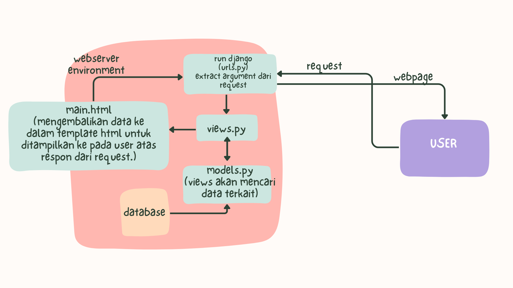

Nama: Clarissa Indriana P
NPM: 2306211660
Kelas: PBP B
Tautan aplikasi PWS: http://clarissa-indriana-kedaibukukopi.pbp.cs.ui.ac.id 

SOAL

Jelaskan bagaimana cara kamu mengimplementasikan checklist di atas secara step-by-step (bukan hanya sekadar mengikuti tutorial)
Mengetahui bahwa: 
main = direktori aplikasi
kedai_buku_kopi = direktori project

1. Membuat sebuah proyek Django baru bernama kedai_buku_kopi yang sebelumnya berada di direktori utama kedai-buku-kopi dan terhubung ke direktori github
2. Membuat direktori aplikasi bernama main
3. Mendaftarkan aplikasi main ke dalam proyek kedai_buku_kopi
4. Setelah itu membuat model di dalam models.py dalam aplikasi main dengan nama class Product, fungsi model adalah untuk menyimpan script database
5. Membuat direktori templates di dalam direktori main. Di dalam direktori templates akan terdapat template (main.html) yang berguna untuk menampilkan data program kedai buku kopi (saat ini aplikasi kedai buku kopi belum punya data apapun)
6. Membuat sebuah fungsi di dalam views.py yang terdapat di dalam direktori aplikasi main untuk dikembalikan ke dalam sebuah template html (view menghubungkan model dengan template)
7. Routing URL aplikasi main dengan cara membuat urls.py di dalam direktori aplikasi main untuk mengatur rute URL yang terkait dengan aplikasi main. Dalam tugas-2 kali ini, urls.py pada aplikasi main digunakan untuk memetakan fungsi yang telah dibuat pada views.py
8. Routing URL proyek kedai_buku_kopi menambahkan rute URL dalam urls.py proyek untuk menghubungkannya ke tampilan main
9. Deployment ke PWS dengan menambahkan server PWS ke ALLOWED HOST proyek kedai_buku_kopi
10. Proyek sekarang dapat diakses melalui internet

Buatlah bagan yang berisi request client ke web aplikasi berbasis Django beserta responnya dan jelaskan pada bagan tersebut kaitan antara urls.py, views.py, models.py, dan berkas html.
Membuat request dari internet -> webserver environment -> run django -> extract argument dari request -> diteruskan ke views.py <-> views akan mencari data terkatit di models.py -> mengembalikan data ke dalam template html untuk ditampilkan ke pada user atas respon dari request.

Jelaskan fungsi git dalam pengembangan perangkat lunak!
Git digunakan untuk beberapa hal, seperti:
1. Pengelolaan Repositori: Git digunakan untuk penyimpanan dan pengelolaan repositori baik di lokal komputer maupun server seperti github.
2. Melacak Perubahan Kode: Terdapat history revisi yang memungkinkan pengembang untuk melacak setiap perubahan yang dilakukan pada kode sumber. Setiap kali ada perubahan yang disimpan (disebut sebagai commit), Git mencatat versi baru dari proyek, lengkap dengan catatan siapa yang membuat perubahan, kapan perubahan itu dibuat, dan deskripsi perubahan tersebut.
3. Kolaborasi Tim: Git memudahkan banyak pengembang untuk bekerja bersama pada proyek yang sama. Dengan Git, setiap pengembang dapat bekerja pada salinan lokal dari proyek, membuat perubahan, dan kemudian menggabungkannya kembali ke repositori utama.

Menurut Anda, dari semua framework yang ada, mengapa framework Django dijadikan permulaan pembelajaran pengembangan perangkat lunak?
1. Mudah dipelajari
2. Terstruktur
3. Pendekatan berbasis MVT yang banyak digunakan dalam pengembangan perangkat lunak. Memahami MVT membantu pemula mengerti konsep dasar pemisahan tanggung jawab dan manajemen pengembangan aplikasi, dan hal tersebut sangat penting dalam pengembangan perangkat lunak skala besar.
4. Popularitas, sudah digunakan di industri Django digunakan oleh banyak perusahaan besar dan proyek skala industri.

Mengapa model pada Django disebut sebagai ORM?
Model dalam Django disebut sebagai ORM (Object-Relational Mapping) karena berfungsi sebagai lapisan yang menghubungkan antara objek dalam kode Python dengan tabel dalam basis data relasional. ORM memungkinkan pengembang untuk bekerja dengan data menggunakan konsep objek dalam bahasa pemrograman, tanpa harus menulis SQL secara langsung untuk berinteraksi dengan basis data. 
