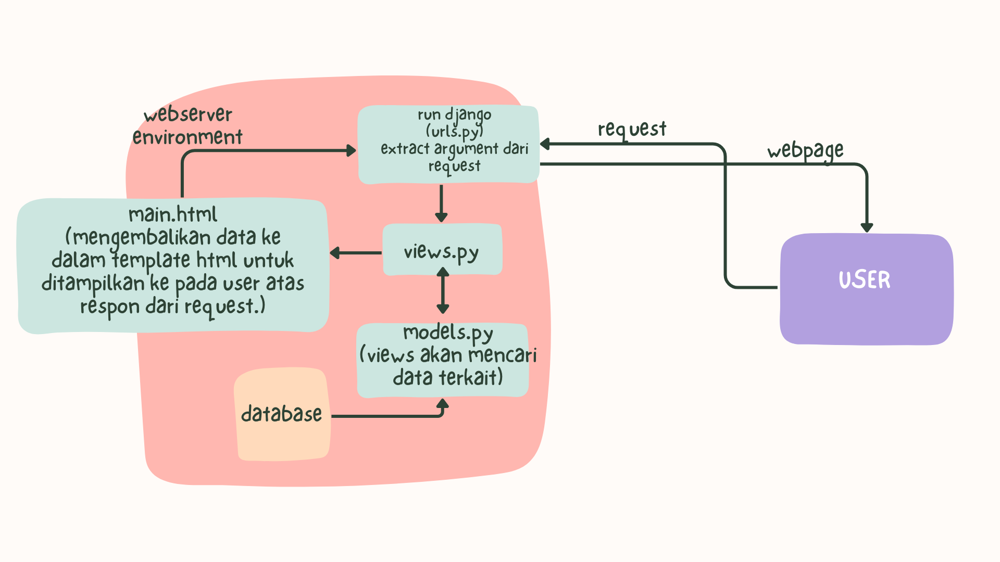

# Kedai Buku Kopi

Nama: Clarissa Indriana P
NPM: 2306211660
Kelas: PBP B

Tautan aplikasi PWS: http://clarissa-indriana-kedaibukukopi.pbp.cs.ui.ac.id 

## Tugas 2

### Pembuatan Project Django
Mengetahui bahwa: 
main = direktori aplikasi
kedai_buku_kopi = direktori project

1. Membuat sebuah proyek Django baru bernama kedai_buku_kopi yang sebelumnya berada di direktori utama kedai-buku-kopi dan terhubung ke direktori github
2. Membuat direktori aplikasi bernama main
3. Mendaftarkan aplikasi main ke dalam proyek kedai_buku_kopi
4. Setelah itu membuat model di dalam models.py dalam aplikasi main dengan nama class Product, fungsi model adalah untuk menyimpan script database
5. Membuat direktori templates di dalam direktori main. Di dalam direktori templates akan terdapat template (main.html) yang berguna untuk menampilkan data program kedai buku kopi (saat ini aplikasi kedai buku kopi belum punya data apapun)
6. Membuat sebuah fungsi di dalam views.py yang terdapat di dalam direktori aplikasi main untuk dikembalikan ke dalam sebuah template html (view menghubungkan model dengan template)
7. Routing URL aplikasi main dengan cara membuat urls.py di dalam direktori aplikasi main untuk mengatur rute URL yang terkait dengan aplikasi main. Dalam tugas-2 kali ini, urls.py pada aplikasi main digunakan untuk memetakan fungsi yang telah dibuat pada views.py
8. Routing URL proyek kedai_buku_kopi menambahkan rute URL dalam urls.py proyek untuk menghubungkannya ke tampilan main
9. Deployment ke PWS dengan menambahkan server PWS ke ALLOWED HOST proyek kedai_buku_kopi
10. Proyek sekarang dapat diakses melalui internet

### SOAL

**Bagan yang berisi request client ke web aplikasi berbasis Django beserta responnya.**
Membuat request dari internet -> webserver environment -> run django -> extract argument dari request -> diteruskan ke views.py <-> views akan mencari data terkatit di models.py -> mengembalikan data ke dalam template html untuk ditampilkan ke pada user atas respon dari request.

**Fungsi git dalam pengembangan perangkat lunak!**
Git digunakan untuk beberapa hal, seperti:
1. Pengelolaan Repositori: Git digunakan untuk penyimpanan dan pengelolaan repositori baik di lokal komputer maupun server seperti github.
2. Melacak Perubahan Kode: Terdapat history revisi yang memungkinkan pengembang untuk melacak setiap perubahan yang dilakukan pada kode sumber. Setiap kali ada perubahan yang disimpan (disebut sebagai commit), Git mencatat versi baru dari proyek, lengkap dengan catatan siapa yang membuat perubahan, kapan perubahan itu dibuat, dan deskripsi perubahan tersebut.
3. Kolaborasi Tim: Git memudahkan banyak pengembang untuk bekerja bersama pada proyek yang sama. Dengan Git, setiap pengembang dapat bekerja pada salinan lokal dari proyek, membuat perubahan, dan kemudian menggabungkannya kembali ke repositori utama.

**Dari semua framework yang ada, mengapa framework Django dijadikan permulaan pembelajaran pengembangan perangkat lunak?**
1. Mudah dipelajari
2. Terstruktur
3. Pendekatan berbasis MVT yang banyak digunakan dalam pengembangan perangkat lunak. Memahami MVT membantu pemula mengerti konsep dasar pemisahan tanggung jawab dan manajemen pengembangan aplikasi, dan hal tersebut sangat penting dalam pengembangan perangkat lunak skala besar.
4. Popularitas, sudah digunakan di industri Django digunakan oleh banyak perusahaan besar dan proyek skala industri.

**Mengapa model pada Django disebut sebagai ORM?**
Model dalam Django disebut sebagai ORM (Object-Relational Mapping) karena berfungsi sebagai lapisan yang menghubungkan antara objek dalam kode Python dengan tabel dalam basis data relasional. ORM memungkinkan pengembang untuk bekerja dengan data menggunakan konsep objek dalam bahasa pemrograman, tanpa harus menulis SQL secara langsung untuk berinteraksi dengan basis data. 

## Tugas 3

### Implementasi Form dan Data Delivery

**Skeleton sebagai kerangka views**
Berfungsi sebagai kerangka views dari situs web dan dapat memastikan adanya konsistensi dalam desain situs web serta memperkecil kemungkinan terjadinya redundansi kode.

1. Buat direktori templates pada direktori utama (root folder)
Membuat berkas html baru bernama base.html. Berkas base.html berfungsi sebagai template dasar. Template turunan akan me-extend template dasar (base.html) dan mengganti konten di dalam   sesuai kebutuhan.
2. Memasukkan direktori templates ke dalam settings.py yang ada di dalam direktori proyek (kedai_buku_kopi)
'DIRS': [BASE_DIR / 'templates']
3. Di subdirektori templates yang terdapat di direktori main (main/templates/) buat main.html meng-extends base.html sebagai template utama dengan menambahkan block tertentu

**Membuat Form Input Data dan Menampilkan Data Product Pada HTML**
1. Mengubah primary key ID dari setiap objek model dari integer ke UUID pada berkas models.py untuk keamanan
2. Buat berkas baru pada direktori main dengan nama forms.py untuk membuat struktur form yang dapat menerima data Product baru

model = Product 
Digunakan untuk menunjukkan model yang akan digunakan untuk form. Ketika data dari form disimpan, isi dari form akan disimpan menjadi sebuah objek Product

fields = ['name', 'price', 'description', 'rating', 'pairing']
Untuk menunjukkan field dari model Product yang digunakan untuk form. 

3. Di berkas views.py, buat fungsi baru dengan nama create_product yang menerima parameter request untuk menghasilkan form yang dapat menambahkan data Product secara otomatis ketika data di-submit dari form.

4. Menambahkan key:value baru di dalam context di fungsi show_main yang berada di views.py berdasarkan product_entries = Product.objects.all() yang digunakan untuk mengambil seluruh objek Product yang tersimpan pada database.

5. Buka urls.py yang ada pada direktori main. Import fungsi baru yang sudah dibuat, yaitu create_product, dan tambahkan URL path ke dalam variable urlpatterns untuk mengakses fungsi create_product
	
6. Buat berkas HTML baru dengan nama create_product.html pada direktori main/templates. Terdapat template tag yang digunakan untuk menampilkan fields form yang sudah dibuat pada forms.py sebagai table. Selain itu, ada tombol submit untuk mengirimkan request ke view create_product(request). Menggunakan form dengan metode FORM

7. Buka berkas main.html dan menambahkan kode untuk menampilkan data Product dalam bentuk tabel serta tombol "Add New Product” yang akan redirect ke halaman form.

**Mengembalikan Data dalam Bentuk XML dan JSON**
1. Buat fungsi baru di views.py direktori main  yang menerima parameter request dengan nama show_xml dan show_json 

2. Buat sebuah variabel di dalam fungsi tersebut yang menyimpan hasil query dari seluruh data yang ada pada Product dan me-return function berupa HttpResponse yang berisi parameter data hasil query yang sudah diserialisasi menjadi XML atau JSON

3. Buka urls.py di direktori main untuk mengimport fungsi baru yang sudah dibuat dan menambahkan path url ke dalam urlpatterns untuk mengakses fungsi yang sudah diimpor

**Mengembalikan Data Berdasarkan ID dalam Bentuk XML dan JSON**
1. Buka views.py yang ada pada direktori main dan membuat dua fungsi baru yang menerima parameter request dan id dengan nama show_xml_by_id dan show_json_by_id

2. Buat sebuah variabel di dalam fungsi tersebut yang menyimpan hasil query dari data dengan id tertentu yang ada pada Product dan me-return function berupa HttpResponse yang berisi parameter data hasil query yang sudah diserialisasi menjadi XML atau JSON

3. Buka urls.py di direktori main untuk mengimport fungsi baru yang sudah dibuat dan menambahkan path url ke dalam urlpatterns untuk mengakses fungsi yang sudah diimpor

### SOAL
**Mengapa kita memerlukan data delivery dalam pengimplementasian sebuah platform**
Data delivery memungkinkan data yang ada di server atau database pusat dapat diakses oleh pengguna di berbagai lokasi. Platform perlu berintegrasi dengan layanan lain seperti API eksternal. Data delivery memastikan data yang diperlukan dapat dikirim dan direrima dengan format yang sesuai, sehingga memungkinkan kolaborasi antar sistem.

**Mana yang lebih baik antara XML dan JSON? Mengapa JSON lebih populer dibandingkan XML?**
JSON
- JSON memiliki struktur yang lebih sederhana dan ringan. Formatnya terdiri atas key:value. JSON lebih mudah dipahami dan lebih sederhana dalam hal sintaks dibandingkan XML.
- JSON dirancang untuk pertukaran data, sehingga lebih cocok digunakan dalam API, web services, dan komunikasi data antar aplikasi.

XML
- XML menggunakan elemen dan tag, seperti <element></element>, membuatnya lebih sulit dibaca dan dipahami secara visual.
- XML selain digunakan untuk pertukaran data, juga dirancang untuk mendeskripsikan dokumen yang kompleks dan memiliki struktur hierarki yang lebih formal. XML lebih cocok untuk dokumen yang membutuhkan metadata atau markup yang lebih kompleks.

Kesimpulan: JSON lebih baik dalam hal kecepatan, kesederhanaan, dan efisiensi. XML digunakan dalam konteks di mana dibutuhkan dokumen yang lebih kompleks dan terstruktur secara mendetail. JSON lebih populer karena lebih sesuai dengan kebutuhan teknologi modern yang mengutamakan kecepatan, efisiensi, dan kesederhanaan.

**Apa fungsi dari method is_valid() pada form Django dan mengapa kita membutuhkan method tersebut?**
Method is_valid() pada form di Django memiliki fungsi utama untuk memvalidasi data yang dikirimkan melalui form. Ketika sebuah form menerima data input dari pengguna, seperti melalui POST request, method ini digunakan sebagai sistem validasi otomatis untuk berbagai jenis input (misalnya, integer, email, URL) sehingga pengembang tidak perlu menulis validasi sendiri setiap kali menerima input dari pengguna.

**Mengapa kita membutuhkan csrf_token saat membuat form di Django? Apa yang dapat terjadi jika kita tidak menambahkan csrf_token pada form Django? Bagaimana hal tersebut dapat dimanfaatkan oleh penyerang?**
csrf_token adalah nilai unik yang dihasilkan secara acak dan dimasukkan ke dalam form. Token ini bertindak sebagai lapisan keamanan tambahan dengan memastikan bahwa permintaan yang dikirimkan berasal dari pengguna yang sah dan bukan dari penyerang yang berusaha mengeksploitasi sesi pengguna yang telah diautentikasi. Saat permintaan dikirim ke server, server akan memeriksa apakah token yang dikirim sesuai dengan token yang disimpan di sesi pengguna. Jika token tidak valid atau tidak ada, permintaan akan ditolak, melindungi aplikasi dari serangan CSRF. Jika aplikasi tidak menggunakan token CSRF, penyerang dapat memanfaatkan sesi yang telah diautentikasi untuk melakukan tindakan atas nama pengguna, bahkan tanpa interaksi pengguna langsung.

### POSTMAN
**XML**

**JSON**

**XML by ID**

**JSON by ID**
